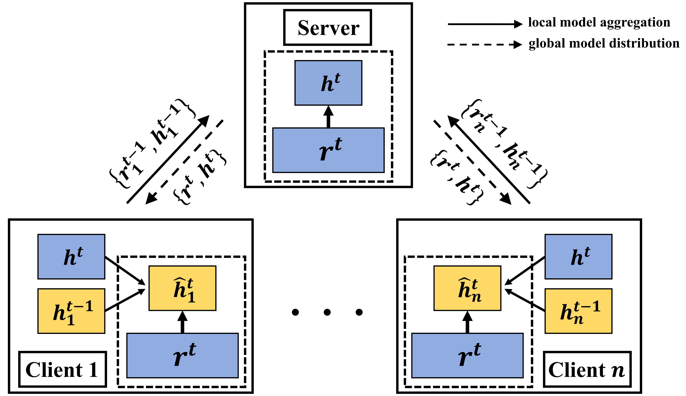
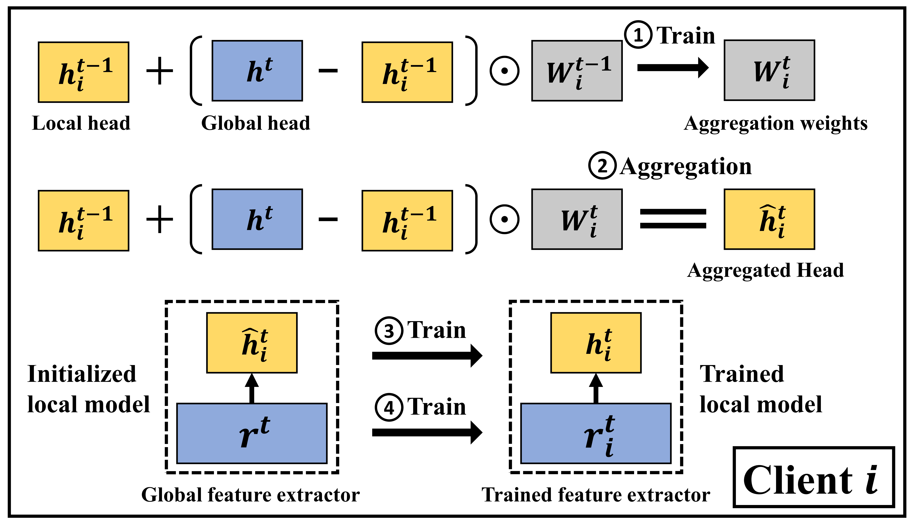

# FedAH: Aggregated Head for Personalized Federated Learning







This project [FedAH](https://github.com/heyuepeng/FedAH) is based on the open source project [PFLlib](https://github.com/TsingZ0/PFLlib) development.

[](https://www.gnu.org/licenses/old-licenses/gpl-2.0.en.html) [](https://arxiv.org/abs/2312.04992)

(https://github.com/heyuepeng/PFLlibVSP/blob/main/structure.png)


## Environments

Install [CUDA](https://developer.nvidia.com/cuda-11-6-0-download-archive).

Install [conda](https://repo.anaconda.com/miniconda/Miniconda3-latest-Linux-x86_64.sh) and activate conda.

```
conda env create -f env_cuda_latest.yaml # You may need to downgrade the torch using pip to match CUDA version
```


## How to start simulating (examples for FedAH)

- Create proper environments (see [Environments](https://github.com/heyuepeng/FedAH#environments)).

- Download [this project](https://github.com/heyuepeng/FedAH) to an appropriate location using [git](https://git-scm.com/).

  ```
  git clone https://github.com/heyuepeng/FedAH.git
  ```

- Run evaluation:

  ```
  cd ./system
  python main.py -data MNIST -m cnn -algo FedAH -gr 2000 -did 0 # using the MNIST dataset, the FedAH algorithm, and the 4-layer CNN model
  ```

  Or you can uncomment the lines you need in `./system/examples.sh` and run:

  ```
  cd ./system
  sh examples.sh
  ```

**Note**: The hyper-parameters have not been tuned for the algorithms. The values in `./system/examples.sh` are just examples. You need to tune the hyper-parameters by yourself.
